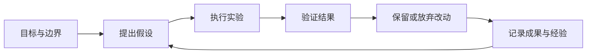

# refbox · 自指引擎

个人 Homelab 的 Web Kanban 与控制层，也是 Agent 的家。让 Agent 围绕目标持续实验、验证成果、积累经验，并通过反馈自主迭代。

## 核心想法

我们的假设是：足够强的模型通过持续尝试，结合验证反馈与经验积累，可以产生实际价值。这个假设需要通过可复现的实验检验。

用户给定目标、资源预算和操作边界，Agent 在范围内自主推进。调研可以帮助提出假设；每轮工作最终需要提供可检查的产物和验证证据。



## 应用方向

- 持续数据分析：提出问题、执行分析、验证结论并积累证据。
- 比赛模型优化：从 baseline 出发，反复实验、评估并保留有效改进。
- 业务中的自我改进循环（SRI）：未来把经过验证的迭代方式应用到具体业务。

## 平台基础

Refbox 为不同个人业务提供工作区、资源注册、Agent 工具、事件与验证接口。监控只是第一个业务插件；长期执行是共享能力。当前附带一个独立随手记插件，检验不相关业务能否通过相同契约接入。

技术栈：Go 控制层 + React + Node / Pi Durable 1.1.0。保留 Engy 与默认 `kimi-k3`。Go 的平台 SQLite、Pi 的执行 SQLite、插件业务数据库和验证器 SQLite 各自独立。业务任务 ID 不再等于 Pi conversation ID，旧会话与自检历史保留。

第一条闭环为 Mac mini 服务监控：15 秒功能采样，连续两次失败开启事件；固定白名单重启最多两次，三次新鲜健康样本后由独立 Prove It Worker 执行固定业务检查及独立模型复核。控制层与 Cloudflare 用户入口还需要真实浏览器检查。HTTP 200、进程存活或执行者自述都不能直接关闭事件。

业务状态、执行状态、验证状态、资源健康分别展示。通用长期任务沿用已批准的 Pi 工作流程，自检结果保留为执行侧断言；人工验收必须记录实际检查依据，并显示 `manual`，不会伪装成独立通过。各业务任务的自动独立验收由相应插件提供，当前实现先覆盖监控事件。

详细说明：[架构](docs/architecture.md)、[插件与 API 契约](docs/v2/contract.md)、[独立服务](docs/v2/services.md)、[具名动作代理](docs/v2/broker.md)、[设计说明](docs/v2/design.md)。

## 本地启动

需要 Go 1.25+、Node.js 24+、npm，以及已配置的 Pi `engy` provider。

```sh
npm ci
npm run configure
npm run build
# 终端一：执行服务
node --env-file=.env apps/runtime/dist/main.js
# 终端二：平台控制层
node scripts/start-control.mjs
# 终端三：独立监控、验证器、随手记
npm run dev:services
```

打开 <http://127.0.0.1:8080>。初始应用密码保存在 `var/bootstrap-password.txt`；配置不提交 Git。再次执行 configure 只补齐缺失配置，已有密码、令牌与数据库地址保留。平台在内置服务就绪后自动读取 manifest，插件管理也支持手动注册、禁用与工作区访问。

`PI_PROFILE_DIR` 指向已配置的 Pi 目录。执行器与独立验证器读取 Engy 模型与直接 API Key，可用 `ENGY_API_KEY` 覆盖。独立验证器的浏览器检查使用应用登录凭据 `REFBOX_VERIFY_PASSWORD`；禁止填入系统 root 密码。将 `REFBOX_PUBLIC_URL` 设为实际 Cloudflare HTTPS 地址，避免只验证本地路径。

本地开发未启动 root broker 时，重启按钮会显示动作不可用。采样、记录、诊断与查看不依赖动作代理，也不要求 Pi 在线。安装前可以将 `REFBOX_AUTO_REPAIR=false` 关闭自动具名重启。

## Mac mini 常驻部署

构建和配置完成后，先生成并校验 launchd 清单，再以管理员身份安装：

```sh
npm run prepare:daemon
node scripts/launchd.mjs
sudo "$(command -v node)" scripts/launchd.mjs --install
```

安装后，`ai.refbox.engine` 以 root 运行，`ai.refbox.control` 以安装者的普通账户运行。另有 root 动作代理 `ai.refbox.broker`，以及普通用户运行的 `ai.refbox.monitor`、`ai.refbox.verifier`、`ai.refbox.scratchpad`。各服务独立由 launchd 保持运行并在退出后重新启动。日志位于 `/Library/Logs/refbox/`。

发布文件、独立 Node 24 运行时和生产数据放在内部盘 `/Library/Application Support/refbox/`。准备脚本下载官方运行时并检查 SHA-256；首次安装迁移开发数据库，后续安装保留生产数据库。生产配置路径由安装器改写，原仓库与开发配置保留。这样避免 root 后台进程因外接盘上的 Homebrew 依赖而无法启动。

可使用 `/Library/Application Support/refbox/var/workspaces` 作为初始工作目录。外接盘业务目录仍受 macOS 的独立隐私权限约束；需要由用户在系统设置中授权，不修改系统隐私数据库。

Go 默认仅监听本机，Cloudflare Tunnel 提供外部 HTTPS 入口；配置 `REFBOX_SECURE_COOKIE=true`。控制台维持单用户登录，不提供多用户注册。

### Cloudflare Tunnel HTTPS 入口

部署入口使用独立的命名 Cloudflare Tunnel。Go 保持监听 `127.0.0.1:8080`，配置 `REFBOX_SECURE_COOKIE=true`，由 Cloudflare 提供浏览器 HTTPS；refbox 自身的单用户登录继续保护任务与控制接口。

在已登录 Cloudflare 的机器上创建独立 Tunnel，并准备一个专用配置文件（不要使用其他应用的默认 Tunnel 配置）：

```sh
cloudflared tunnel create refbox
```

配置中的 `tunnel` 为新建 UUID，`credentials-file` 指向生成的凭据文件；ingress 仅把所选域名转发到 `http://127.0.0.1:8080`，其余请求返回 404。使用专用配置明确创建 DNS 路由，然后安装独立常驻 connector：

```sh
cloudflared tunnel --config var/cloudflare-refbox.yml route dns TUNNEL_UUID refbox.example.com
sudo "$(command -v node)" scripts/install-cloudflare.mjs \
  --hostname refbox.example.com \
  --tunnel TUNNEL_UUID \
  --credentials /absolute/path/to/TUNNEL_UUID.json
```

`ai.refbox.tunnel` 以普通用户运行，发布到内部盘的 connector、配置与凭据位于生产目录。凭据只保存在本机，日志位于 `/Library/Logs/refbox/tunnel*.log`。安装器会校验 ingress；访问地址为所配置的 HTTPS 域名。

Tailscale 已退出 refbox 的部署路径，相关入口已移除。

移除常驻服务但保留配置与数据库：

```sh
sudo "$(command -v node)" scripts/launchd.mjs --uninstall
```

升级需用户决定：停止服务、备份生产目录中的 `var/` 和 `.env`、更新代码与依赖、重新构建、重新安装。Agent 可以开发和测试改进，但工作规则要求它不替换正在运行的版本。

## 使用闭环

在 Homelab 查看资源采样方法、时间、是否过期，以及事件的观察、诊断、动作与证据。自动恢复只对注册并预授权的服务生效；默认 broker 拒绝重启控制层，平台部署仍由用户决定。两次重启未恢复时保留开放事件，停止继续重启，Agent 仍可开展只读诊断。

在长期任务看板创建目标、选择已有工作目录与模型，检查 Agent 提出的计划与固定验证标准后开始。原生持续运行、压缩、恢复、实验、产物、停止、继续与指引沿用 Pi Durable。执行自检成功表示执行完成，业务是否完成与独立验收分开。人工检查后可记录验收依据。每天北京时间 09:00 保存事实汇报，重启后补生成缺失日期。

在插件管理读取版本化 manifest，启用或禁用服务；进入插件工作区查看业务数据，通过声明工具操作业务。插件 UI 使用受控同源代理和隔离 iframe，管理员 Cookie 不转发给插件。首版工作区使用服务端 HTML 与平台工具表单；复杂交互 UI、插件市场与图编辑器后续扩展。插件 SSE 事件用于观察与关联，业务数据库仍由插件维护。

## 验证与当前边界

```sh
npm test
npm run build
node apps/web/test/api-check.mjs
npm run test:ui
# 具备本地网络权限时执行真实 TCP 服务集成
npm run test:services:tcp
```

npm test 使用实际 Pi Durable、文件工具、独立 SQLite、进程崩溃，以及进程内 HTTP 处理器。覆盖计划门槛、持续迭代、恢复去重、只读诊断范围、固定功能检查、独立模型复核、两次动作上限、过期证据和业务/执行/验证状态区别。

浏览器套件包含桌面、移动、键盘、状态操作、插件工作区与错误反馈，默认使用隔离 mock 路由，不修改生产服务。`REFBOX_LIVE_TEST=1 REFBOX_TEST_URL=https://refbox.jeffkafka.top npm --workspace @refbox/web test -- --grep 'live deployment'` 可显式启用生产验收；它会创建带 `[验收]` 标记的任务与随手记，不启动模型执行。安装真实浏览器需 `npx playwright install chromium`。隔离的真实故障闭环见 [服务验收](docs/v2/live-services.md)。

2026-10-10 已部署到当前 Mac mini，沿用现有 Cloudflare 入口。实际 TCP、八项跨进程故障闭环、桌面与手机浏览器、独立 Engy 复核，以及 root Agent 产物验收通过；原有运行历史保留。证据与实际边界见 [验收记录](docs/v2/acceptance.md)。控制层、监控、验证器均与执行器同机；root 可以修改它们，这提供角色分离与可追溯证据，不宣称抵抗同机恶意 root。

需求与后续验收：[状态操作 #2](https://github.com/WASIDJ/refbox/issues/2)、[UI/UX #3](https://github.com/WASIDJ/refbox/issues/3)、[独立验证 #4](https://github.com/WASIDJ/refbox/issues/4)、[插件架构 #5](https://github.com/WASIDJ/refbox/issues/5)。
