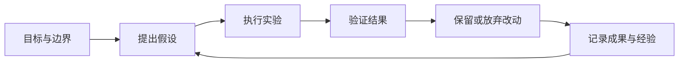

# refbox · 自指引擎

个人 Homelab 的 Web Kanban 与控制层，也是 Agent 的家。让 Agent 围绕目标持续实验、验证成果、积累经验，并通过反馈自主迭代。

## 核心想法

我们的假设是：足够强的模型通过持续尝试，结合验证反馈与经验积累，可以产生实际价值。这个假设需要通过可复现的实验检验。

用户给定目标、资源预算和操作边界，Agent 在范围内自主推进。调研可以帮助提出假设；每轮工作最终需要提供可检查的产物和验证证据。



## 应用方向

- 持续数据分析：提出问题、执行分析、验证结论并积累证据。
- 比赛模型优化：从 baseline 出发，反复实验、评估并保留有效改进。
- 业务中的自我改进循环（SRI）：未来把经过验证的迭代方式应用到具体业务。

## 初步实现

第一版提供 Homelab Web 看板、目标确认、后台执行、实际验证、实验与产物记录、停止与继续、进展汇报和独立服务入口。任务和运行状态由 Pi Durable 的本地 SQLite 持久化。

技术栈：Go 控制层 + Node.js / Pi Durable 1.1.0 + React / TypeScript / Vite。首版只接入 Engy，默认模型为 `kimi-k3`。详细职责和 API 见 [架构说明](docs/architecture.md)。

## 当前状态

## 本地启动

需要 Go 1.24+、Node.js 22.19+、npm，以及已配置的 Pi `engy` provider。

```sh
npm ci
npm run build
npm run configure
# 终端一：执行服务（开发时为普通用户）
node --env-file=.env apps/runtime/dist/main.js
# 终端二：Go 控制服务
node scripts/start-control.mjs
```

打开 <http://127.0.0.1:8080>。初始管理员密码保存在 `var/bootstrap-password.txt`，只有当前用户可读；密码 hash 和内部 token 保存在不提交 Git 的 `.env`。配置脚本不会覆盖已有配置。

`PI_PROFILE_DIR` 必须指向你的 Pi 配置目录，root 服务也使用这个明确路径。执行服务读取 Engy 模型配置与直接 API Key，不读取其他 provider，也不执行凭据中的 shell 命令。可以用 `ENGY_API_KEY` 覆盖凭据来源。

## Mac mini 常驻部署

构建和配置完成后，先生成并校验 launchd 清单，再以管理员身份安装：

```sh
npm run prepare:daemon
node scripts/launchd.mjs
sudo "$(command -v node)" scripts/launchd.mjs --install
```

安装后，`ai.refbox.engine` 以 root 运行，`ai.refbox.control` 以安装者的普通账户运行。两个服务由 launchd 保持运行并在退出后重新启动。日志位于 `/Library/Logs/refbox/`。

发布文件、独立 Node 24 运行时和生产数据放在内部盘 `/Library/Application Support/refbox/`。准备脚本下载官方运行时并检查 SHA-256；首次安装迁移开发数据库，后续安装保留生产数据库。生产配置路径由安装器改写，原仓库与开发配置保留。这样避免 root 后台进程因外接盘上的 Homebrew 依赖而无法启动。

可使用 `/Library/Application Support/refbox/var/workspaces` 作为初始工作目录。外接盘业务目录仍受 macOS 的独立隐私权限约束；需要由用户在系统设置中授权，不修改系统隐私数据库。

默认仅监听本机。需要家庭网络 / VPN 访问时，在 `.env` 配置 `REFBOX_LISTEN` 为目标私网地址；使用 HTTPS 反向代理时设置 `REFBOX_SECURE_COOKIE=true`。不提供公网部署或多用户注册。

### Tailscale 私人 HTTPS 入口

保持 Go 监听 `127.0.0.1:8080`，设置 `REFBOX_SECURE_COOKIE=true` 后重新安装服务，再运行：

```sh
tailscale serve --bg --yes --https=10000 http://127.0.0.1:8080
```

该端口用于独立入口，不占用已有 443 / 8443 服务。实际访问地址由命令返回；Serve 只向 tailnet 提供访问。移除入口使用 `tailscale serve --https=10000 off`，不要 reset 整台机器的 Serve 配置。

移除常驻服务但保留配置与数据库：

```sh
sudo "$(command -v node)" scripts/launchd.mjs --uninstall
```

升级需用户决定：停止服务、备份生产目录中的 `var/` 和 `.env`、更新代码与依赖、重新构建、重新安装。Agent 可以开发和测试改进，但工作规则要求它不替换正在运行的版本。

## 使用闭环

1. 在看板创建目标，指定已有工作目录与模型。
2. 让 Agent 提出计划、完成标准和验证命令；此阶段不执行业务命令。
3. 检查或修改标准后确认，让 Agent 自主实验。
4. 查看原生运行日志、实验声明、真实工具证据和实际验证输出。
5. 验证成功后结束；遇到阻塞等待指引。可随时停止并基于保存的上下文继续。

每天北京时间 09:00 保存汇报到控制台；重启后补生成缺失日期。也可手动保存当天汇报，同一日期不重复生成。

## 验证与边界

```sh
npm test
npm run build
```

测试使用原生 Pi Durable、实际文件工具和 SQLite，覆盖确认门槛、持续迭代、验证失败、停止继续、真实进程崩溃恢复、持久化、去重、认证和事件快照。首次实现已在目标 Mac mini 验证 Engy 的真实调用，以及实际文件生成、实验记录和成果验证闭环。

两个服务启动后，可以准备安全的文件生成验收任务，再运行浏览器验收（首次需要安装 Playwright Chromium）：

```sh
npm run smoke
npx playwright install chromium
npm run test:ui
```

该验收会使用真实 Engy 模型，在 `var/acceptance/` 内生成文件。已完成的验收任务会被复用，便于重复检查登录、成果预览、汇报和移动端布局。

首版使用固定验证命令判定完成；验证命令的有效性由用户确认。业务应用独立运行，财务、比赛模型等并未内置。远程节点、其他 agent/provider、常驻周期任务与完整服务管理面板留待后续。

初步实现需求见 [Issue #1](https://github.com/WASIDJ/refbox/issues/1)。
