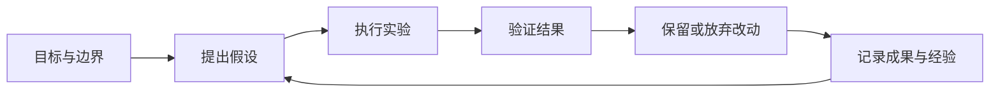

# refbox · 自指引擎

让 Agent 围绕目标持续实验、验证成果、积累经验，并通过反馈自主迭代。

## 核心想法

我们的假设是：足够强的模型通过持续尝试，结合验证反馈与经验积累，可以产生实际价值。这个假设需要通过可复现的实验检验。

用户给定目标、资源预算和操作边界，Agent 在范围内自主推进。调研可以帮助提出假设；每轮工作最终需要提供可检查的产物和验证证据。

## 应用方向

- 持续数据分析：提出问题、执行分析、验证结论并积累证据。
- 比赛模型优化：从 baseline 出发，反复实验、评估并保留有效改进。
- 业务中的自我改进循环（SRI）：未来把经过验证的迭代方式应用到具体业务。

## 初步实现

先在个人 Homelab 的 Mac mini 上验证单个任务的持续迭代闭环：后台运行、连续实验、结果验证、保存可复现产物和失败经验，并生成次日汇报。

长期交互愿景是通过 Web Kanban 安排任务和查看进展。初期先验证执行闭环；完整看板调度、自主寻找优化目标、修改自身引擎和多任务并行留待后续讨论。

## 当前状态

本仓库当前用于记录需求、调研和讨论，尚无可运行实现。最终方案、首个实验场景、验证指标、预算、汇报时间与渠道均待讨论；Pi 与相关扩展是候选技术。

初步实现需求见 [Issue #1](https://github.com/WASIDJ/refbox/issues/1)。
