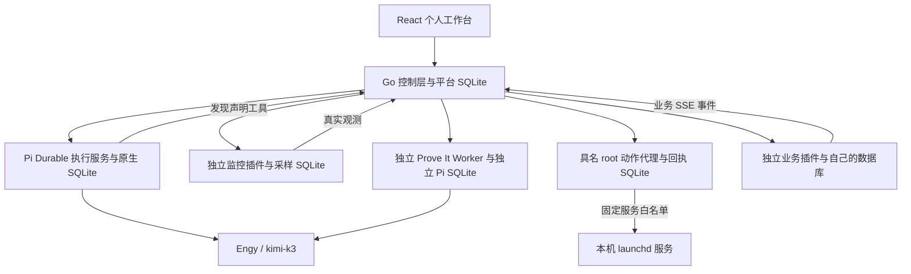

# Refbox 的平台职责与扩展

Refbox 是个人 Homelab 的 Agent 工具桌与试验台。不同业务维护自己的数据、界面和验证标准；共享平台提供任务、执行器与验证器接入、事件、具名动作、证据索引和控制界面。长期看板、loop 与 graph 协作属于平台能力，财务、量化、NAS、copyhistory、LLM Wiki 和人际关系图属于业务插件。

## 状态与数据所有权

| 状态           | 所有者           | 意义                                              |
| -------------- | ---------------- | ------------------------------------------------- |
| 业务任务       | Go 平台          | 待安排、进行中、需处理、完成；独立业务 ID         |
| 执行任务与会话 | Pi Durable       | 规划、待确认、运行、停止、阻塞、执行结束          |
| 验证           | 独立验证器与平台 | pass / fail / inconclusive / manual；自检另外保留 |
| 资源健康       | 独立采集器与平台 | 健康、失败、未知、样本过期                        |
| 领域数据       | 业务插件         | 笔记、资金、资产、机器、知识、人际关系等          |

Go 独立数据库通过带版本的事务快照保存注册清单、资源、业务任务、事件、故障、动作范围、验证证据与工作者状态。Pi 的对话、执行、工具历史、恢复和压缩仍由原生 Pi Durable 管理；Go 不复制原生调度器。旧任务自动导入独立业务 ID，并保留 conversation 映射与历史自检，避免升级时把旧自检升级为独立验收。

## 运行与恢复

普通目标仍经计划确认后使用本地工具自主执行，onYield 在目标未通过执行自检时继续；实验与真实工具 entry 分别保存。根权限执行器保留已授权操作范围。故障诊断则使用单独持久会话，只提供目标资源观察及声明的只读插件工具，没有 CodingTools 或基础设施修改工具。

监控每 15 秒采集固定业务断言，连续两次失败创建事件。平台可在 Pi 离线时调用独立 broker 重启已注册、预授权的具名服务。每个事件最多两次动作；不同请求不能绕过这个持久上限。broker 在执行前提交动作回执，同一动作 ID 不会重复重启，崩溃产生的模糊回执需要人工检查。平台升级或控制层重启默认由人决定。

观察 → 诊断 → 行动 → 验证 → 关闭，失败则回到诊断或等待用户。独立诊断是解释与建议来源，健康检查和已授权恢复不依赖故障中的 Pi。健康采样连续性在长间隔后重置，禁用或撤销资源不能采样、重启或沿用旧验证结果。

## Prove It Worker

固定注册标准来自 manifest，调用者不能替换成更宽松的测试。验证器重新读取注册范围，执行新鲜 HTTP 内容、JSON、指标或浏览器断言，通过独立 Pi 会话复核覆盖、矛盾及证据不足。没有执行工具，不修改基础设施。服务恢复需三次新鲜健康采样，全部固定断言通过，模型明确同意，且资源、事件、动作、版本、环境与时间相符。用户入口要实际呈现已登录的工作台。

证据不足、模型不可用、浏览器缺失、过期或范围改变时保留 inconclusive；人工验收记录 manual。普通长期任务的历史 verify_result 只是 execution_assertion，不冒充独立证明。领域任务未来由对应插件提供独立标准和验收适配器；当前自动验收覆盖监控事件。

## 插件与接口

独立服务通过版本化 manifest 声明工作区、资源、工具 HTTP 方法、事件和验收要求。后端只允许注册的本机 HTTP 服务；凭据通过指定环境变量读取，不进入浏览器。平台发现能力并通过清单选择工具目标，模型不选择任意请求目的地址。

首版支持可信插件。隔离工作区使用服务端 HTML，与平台声明工具表单配合；复杂交互客户端后续引入受控消息桥。插件业务事件接入平台索引，SSE 重连为尽力传递；可靠业务状态依然以插件数据库为准。随手记插件具有自己的表与幂等命令，平台核心不新增笔记业务表。

API 细节见 [契约](v2/contract.md)。旧 /api/tasks 与原生事件接口继续兼容；新 UI 使用 /api/platform/snapshot、/events 与独立业务任务 ID。/health 独立于执行器。所有写操作继续通过单用户会话、来源验证和请求回执，服务间使用独立 Bearer 凭据。

## 部署边界

执行器与 broker 为 root，Go 控制层、采集器、验证器与业务插件为普通用户。每个进程由 launchd 独立守护，数据留在内部盘的不同 SQLite 文件。Cloudflare Tunnel 保持既有用户入口与专用配置，代理和 Tailscale 不属于此次变更。

同机 root 能修改平台和证据，因此这里的独立性是运行角色、会话、工具和记录分离，并非恶意 root 下的防篡改证明。扩展更多 Agent 时先检查资源互斥、验证覆盖、误报与人工处理成本；不同角色可注册多个工作者，当前默认执行和验证路由为本机实例。
