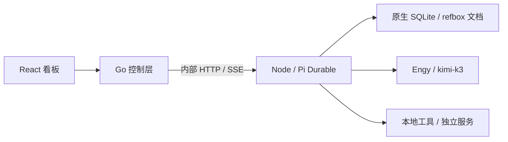

# refbox 的职责与扩展

## 第一版目标

refbox 是 Homelab 的任务看板与控制层，也是 agent 的家。业务（财务、模型实验等）各自维护服务与数据，refbox 保存目标、控制 agent、呈现证据，并登记业务入口。

Go 只负责入口、认证、转发、静态文件与日报触发，不拥有 SQLite，也不重写任务调度。Node 是数据库唯一写入者；会话、提交、执行、重试、压缩、恢复和事件观察复用 Pi Durable 1.1.0。

## 执行闭环

每张卡片关联一个原生 conversation；多个任务可在同一个 Harness 中存在。首版沿用原生调度，不添加全局时长预算或额外并发限额。

规划时只提供 `propose_plan`，且工具 hook 阻止未确认的业务操作。计划包含执行步骤、完成标准与验证命令，用户可以修改后确认。确认后提供原生 read/write/edit/bash 和 refbox 的实验、验证与阻塞工具。

`onYield` 在目标仍运行时驱动下一轮，实验经验放在持久文档中，并向 agent 呈现最近记录。`verify_result` 实际执行固定的已批准命令，保存退出码和输出；只有退出码 0 才将任务标记完成。测试命令必须由用户确认确实覆盖目标，尤其是模型优化不能仅凭训练指标判断。

实验结论标为 agent 的声明，与真实工具结果的 entry ID 分开保存。文件产物预览仅接受实验登记的路径，最多 1 MiB。停止调用原生 abort，保留上下文与产物；继续是新提交，不能让被终止的进程原地复活。

首版受限于所配置的验证命令，并不能保证 agent 不会改坏测试或数据。Agent 有完整本地管理权限，工作规则要求标准改变重新确认、refbox 自身升级由人决定。root 权限服务不是系统权限限制的替代品。

## 公开接口

- `POST /api/login`、`POST /api/logout`、`GET /api/session`：单用户登录。
- `GET /api/models`、`GET /api/health`：模型与执行服务状态。
- `GET /api/tasks`、`POST /api/tasks`、`GET /api/tasks/{id}`：任务创建与状态。
- `POST /api/tasks/{id}/{plan|approve|stop|continue|steer|report}`：控制操作。
- `GET /api/tasks/{id}/view`、`GET /api/events?task={id}`：原生快照与 SSE。
- `GET /api/tasks/{id}/artifact?path=...`：登记产物的文本预览。
- `GET /api/services`、`POST /api/services`：业务目录创建和更新。

写请求携带 `X-Refbox-Request: 1` 与 `Idempotency-Key`。任务与控制命令将请求标识持久化，同键不同内容返回 409；原生提交复用 requestId。控制命令保留执行意图，重启后重新接入已提交工作，不重复改变已完成的结果。

控制台登录使用 PBKDF2-SHA256 密码 hash、HttpOnly / SameSite 会话 cookie，写请求验证来源。Go 到 Node 采用独立内部 token，Node 只监听回环地址。默认仅本机访问；私人网络部署可配置监听地址与 HTTPS 代理。

## 恢复与日报

进程启动重新打开 SQLite，安装相同扩展后调用原生 resume。工具中断遵循原生 replay 策略；未声明安全的工具不会被 refbox 盲目重放。无法继续的执行呈现为阻塞，等待用户指引。

每天北京时间 09:00，Go 根据创建时间与已保存的日期触发缺失日报。每个任务每天一份，内容是生成时的事实快照；重启补生成的历史日期报告明确标注生成时间，不假装重建过去的实时状态。报告不另行调用模型，不中断正在运行的 agent。

## 后续扩展

Go 的执行服务契约与看板不依赖具体业务；以后可以接入远程执行服务或其他 agent 的适配器。首版 loopback 限制是有意的，远程接入需要另做传输认证。业务通过目录说明和 agent 工具接入，不把业务数据库搬进 refbox。

常驻周期职责、完整服务管理界面、其他 provider、跨机器部署与自动更新均未实现。

## Cloudflare Tunnel 部署

独立命名 Tunnel 将 HTTPS 域名转发到 Go 的回环 HTTP 服务，connector 由 `ai.refbox.tunnel` 保持运行。执行器接口仍为仅本机、独立认证的接口，不直接发布到 Tunnel。refbox 的单用户密码、Secure / HttpOnly Cookie 与写请求保护适用于公开域名。

不依赖 Tailscale MagicDNS 或客户端 VPN。部署验证应包括域名的浏览器登录、SSE 状态快照、产物预览与 Cookie 属性；仅 connector 健康不代表网站可用。
